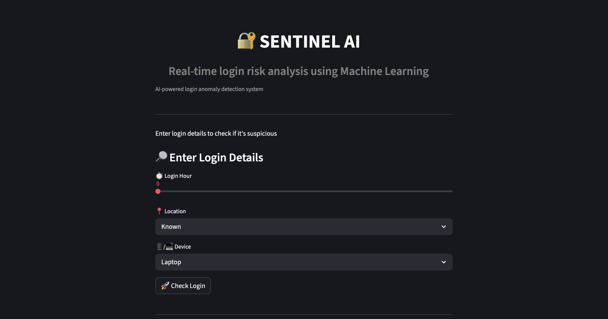
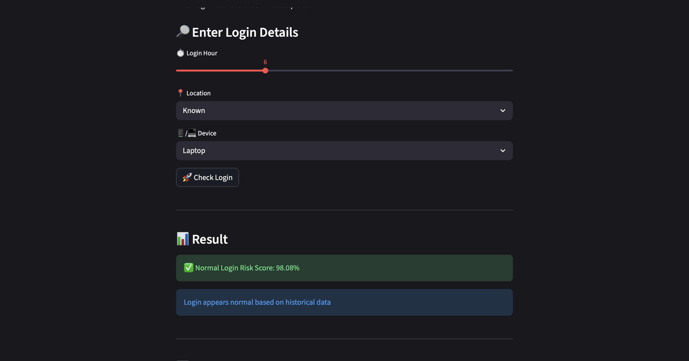
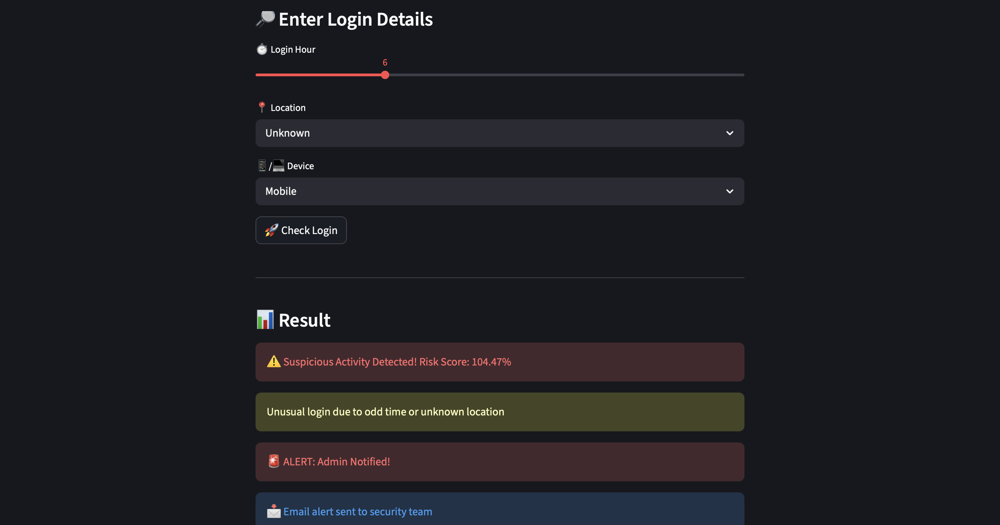
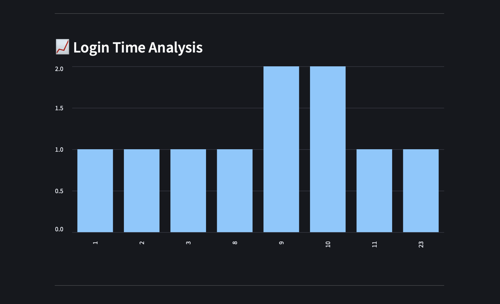
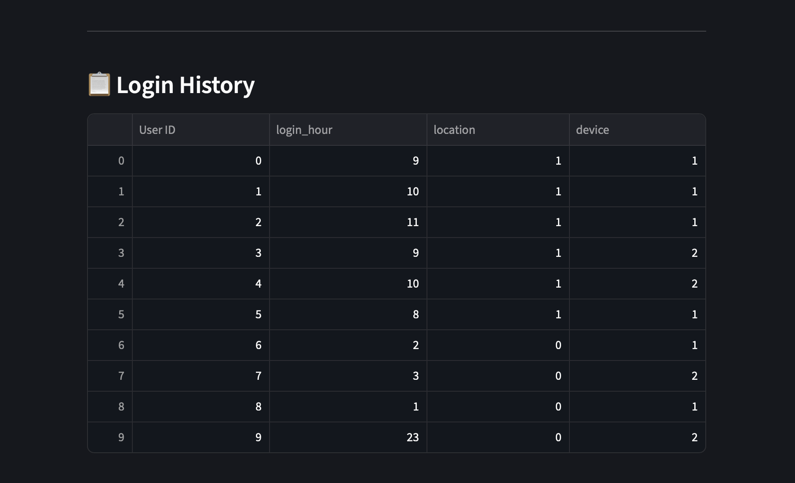

# 🔐 Sentinel AI

AI-powered Cyber Threat Detection System using Machine Learning.

---

## 🚀 Overview

Sentinel AI is a full-stack application that detects suspicious login activity using anomaly detection techniques.
It analyzes user behavior such as login time, location, and device to identify potential security threats.

---

## 🧠 Features

* 🔍 Real-time login anomaly detection
* 📊 Risk score calculation
* 🚨 Alert system for suspicious activity
* 📈 Login time analysis (graph)
* 📋 Login history visualization
* 🌐 Full-stack architecture (Frontend + Backend)

---

## 🛠️ Tech Stack

* **Frontend:** Streamlit
* **Backend:** Flask
* **Machine Learning:** Isolation Forest (Scikit-learn)
* **Language:** Python

---

## ⚙️ How It Works

1. User enters login details (hour, location, device)
2. Data is sent to Flask backend via API
3. ML model analyzes behavior using Isolation Forest
4. System classifies login as:

   * ✅ Normal
   * ⚠️ Suspicious
5. Risk score is generated and displayed

---

## ▶️ Run Locally

### 🔹 Step 1: Start Backend

```bash
python3 backend.py
```

---

### 🔹 Step 2: Start Frontend

```bash
python3 -m streamlit run app.py
```

---

## 📸 Screenshots

### 🔹 User Interface


### 🔹 Detection Result


### 🔹 Analysis Graph


---

## 📌 Future Improvements

* 📧 Real email alert system
* 🗄️ Database integration (MongoDB / MySQL)
* 🔐 User authentication system
* ☁️ Cloud deployment

---

## 👩‍💻 Author

**Rasiajael**

---

## ⭐ If you like this project

Give it a star on GitHub!
